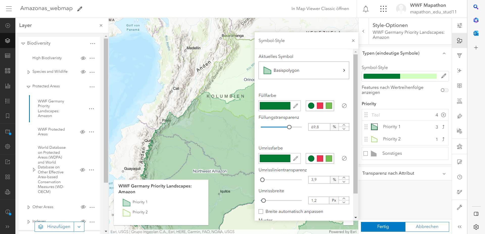

# Web Map of the Amazon Rainforest

## Introduction
In this project, a web application displaying data of the Amazon Rainforest was developed using Esri's ArcGIS Pro and ArcGIS Online. In the application, a user can interactively view geographic data with a focus on environmental conservation of the Amazon Rainforest, toggle different thematic layers and compare its characteristics to other regions. Aim is to provide an interface to explore the WWF Priority Regions by interested users. The idea and part of the implementation were established within an Esri mapathon from the 28.04.-31.04. in Berlin in collaboration with the WWF Germany. The application will be published by the WWF in the following weeks on https://globil.panda.org/ when it has been reviewed. Until then, the following video showing its funcionalities will have to subsitute a more interactive user experience:

https://user-images.githubusercontent.com/116874799/229278450-3a708320-5373-4aab-b940-ab624adf880b.mp4

## Workflow
The Web App was developed using Esri's ArcGIS Pro and ArcGIS Online. These are license-based GIS softwares. The performed workflow is visualised in the following flowchart:

First, multiple data sets relevant to the study area and aim of the application were downloaded both from open-access online resources and from the ArcGIS Online Layers, i.e. features hosted by ArcGIS Online. Data acquired from other sources were reprojected to EPSG:3857 reference system using ArcGIS Pro. 
Then, a web map was created using ArcGIS Online. All layers that had been downloaded from open-access online resources were uploaded to ArcGIS Online whilst further ArcGIS Online Layers were directly integrated into the map. All layers were grouped into the main categories Biodiversiy, Environment, Socioeconomic and Drivers of Change and Threat and further sub categories. This should later make the usage of the web app more intuitive and neat. Furthermore, the different layers were styled, either categorized by attribute or just visualised with appropriate colouring. The layers which should be visible when starting the application were toggled visible.

Lastly, a web app was created using the ArcGIS Experience Builder. This step is necessary to publish the map and add various functions for a good user experience. The title and application icon, i.e. the WWF panda, were set. Then widgets such as the layer overview, legend, search bar, zooom panel and scale bar were added to the user interface. Also, a pop-up window which is opened at the launch of the application was added, providing information about the study area and idea behind the app.

## Results

The Amazon rainforest extends over nine South American states, the largest share located in Brazil. The WWF priority regions are located in Bazil, Venezuela, Columbia, Ecuador and Peu. It is the world's largest wet tropical rain forest and home to more than 40000 species of plants, 427 species of mammals, 1294 species of birds and more than 3000 species of fish. This can be seen in the Global Safety Net High Biodiversity Area Layer (https://www.globalsafetynet.app/). However, their existence is threatened by drivers of Change and Threat such as deforestation due to agriculture and mining and other serious encroachments that continue apace. Data from the Global Forest Watch (https://www.globalforestwatch.org/) shows the loss in tree cover extent between 2000 and 2017 as well as the Global Forest Fragmentation Change and Hot Spots of Deforestation. Deforestation does not only lead to a loss of tree cover and thus valuable carbon storage, but also to a loss of wildlife habitats and corridors. Additionally, the main drivers of the deforestation can be viewed in the web app, such as the global distribution of cattle and cropland areas, both surveyed by the WWF.

## Conclusion

The web application provides a user-friendly, informative web experience to explore data of the Amazon rainforest. Different layers are grouped thematically can be toggled on and off by preference. The creation of the application using ArcGIS Online is very convenient. The only downside is that its usage requires a licence. As future work, open-source software with similar functionalities could be explored, e.g. the Web App Builder for QGIS. This project was created in collaboration with Esri and the WWF. This opportunity motivated me to explore software and applications of GIS outside of the course content of the MB1 lecture. I hope that it is a fun, alternative project and complements the submissions of my fellow students.
